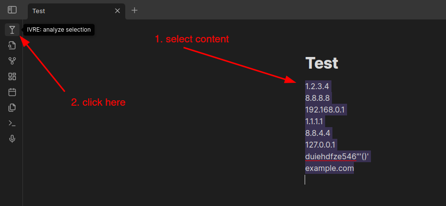
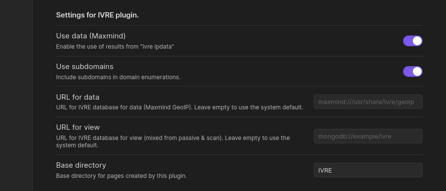

# Obsidian IVRE Plugin

This is an [IVRE](https://ivre.rocks) plugin for [Obsidian](https://obsidian.md). It grabs data from IVRE and brings it into Obsidian notes. It requires to have the IVRE CLI installed.

It combines the data from IVRE with the organization of Obsidian to make notes taking for pentests or red team engagments , incident response, cyberthreat intelligence, etc. easier than ever.

Only `ipdata` (Maxmind GeoIP, address types) and `view` are used. If you have scan results or passive data that you want to use, just run `ivre db2view` to create or update a `view`.

# Learn more

- about IVRE, see [ivre.rocks](https://ivre.rocks/)
- about Obsidian, see [obsidian.md](https://obsidian.md/)

# Usage

Install and enable the plugin, then select some text containing IP addresses, networks or hostnames and click the `martini` icon (or run the command `ivre-analyze-selection`).

You can also add a hotkey for the `ivre-analyze-selection` command: go to "Settings" then "Hotkeys", filter by typing "ivre" and look for "IVRE: Analyze selection with IVRE"; click on the "(+)" button to select your hotkey (I use "Ctrl + Shift + I").

# Development

Run this, and start coding!
```sh
$ ln -s `pwd` "/path/to/your/Obsidian Vault/.obsidian/plugins/obsidian-ivre-plugin"
$ npm run dev
```

# Screenshots #





